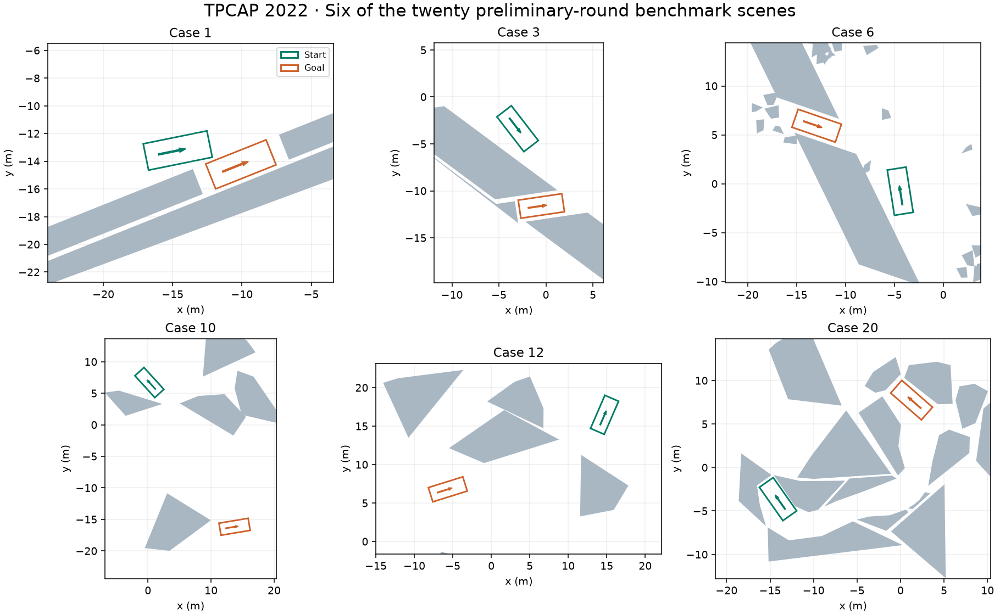

# TPCAP — Automated Parking Benchmarks and Competition Archive

**Twenty challenging parking scenes, and the story of the competition that brought them together.** This repository preserves the preliminary-round benchmarks of the **Trajectory Planning Competition of Automated Parking (TPCAP)**, organized with **IEEE ITSC 2022**.

TPCAP let researchers compare planning algorithms by submitting trajectories, without requiring perception, localization or a physical vehicle platform. The competition drew **61 teams from 24 institutions and companies**, with **466 preliminary submissions**. Its legacy is a collection of challenging scenes, practical evaluation lessons and reusable research resources.



*Gray polygons are obstacles; green marks initial vehicle poses and orange marks target poses. These are scenario inputs, not planned trajectories.*

## Competition homepage

The complete static homepage is included at **[`docs/index.html`](docs/index.html)**. It covers the motivation, competition stages, benchmark categories, evaluation principles, final leaders, lessons learned, resources and paper citation. Download the repository and open that file in a browser to view the designed page locally; keep its `assets/` folder alongside it.

This is a **historical research archive**. The 2022 event has concluded, and this repository does not operate a submission server or live leaderboard.

## What is in the repository?

| Content | Purpose |
| --- | --- |
| `Case1.csv` … `Case20.csv` | The twenty released preliminary-round scene definitions. |
| `docs/index.html` | Competition homepage, self-contained apart from local images/styles. |
| `docs/benchmarks/index.html` | Data-format and coordinate-convention guide. |
| `docs/assets/tpcap.css` | Responsive website styling. |
| `docs/assets/benchmark_scenes.png` | Preview drawn from the released CSV cases. |
| `docs/.nojekyll` | Serve the site as plain static HTML on GitHub Pages. |

There are no planning functions in this data repository. For executable readers and drawing functions, use the [MATLAB demo](https://github.com/libai1943/TPCAP_demo_Matlab) or [Python demo](https://github.com/libai1943/TPCAP_demo_Python). Those demos load and display the same cases; they do not implement the competition's scoring controller.

## Load a case

The files contain a flat sequence of numbers, stored as a single CSV row in this release. Read the sequence rather than relying on row/column orientation.

```python
import numpy as np

v = np.loadtxt('Case1.csv', delimiter=',').reshape(-1)
initial_pose, target_pose = v[:3], v[3:6]
n_obstacles = int(v[6])
vertex_counts = v[7:7 + n_obstacles].astype(int)
cursor = 7 + n_obstacles
obstacles = []
for n in vertex_counts:
    obstacles.append(v[cursor:cursor + 2*n].reshape(n, 2))
    cursor += 2*n
assert cursor == len(v)
```

For MATLAB (R2019a or later for `readmatrix`):

```matlab
v = readmatrix('Case1.csv');
v = v(:);
initial_pose = v(1:3);
target_pose = v(4:6);
n_obstacles = v(7);
vertex_counts = v(8:7+n_obstacles);
obstacles = cell(1, n_obstacles);
cursor = 8 + n_obstacles;
for k = 1:n_obstacles
    n = vertex_counts(k);
    obstacles{k} = reshape(v(cursor:cursor+2*n-1), 2, [])';
    cursor = cursor + 2*n;
end
assert(cursor == numel(v) + 1);
```

## Data format

```text
x0, y0, theta0, xf, yf, thetaf, m,
n1, ..., nm,
x11, y11, ..., x1n1, y1n1,
...,
xm1, ym1, ..., xmnm, ymnm
```

- `(x0, y0, theta0)` and `(xf, yf, thetaf)` are the initial and target poses.
- The position reference is the **rear-axle midpoint**. Positions are in **meters**, angles in **radians**.
- `m` is the number of obstacle polygons; `ni` is the vertex count of polygon `i`.
- Vertices appear in polygon order as interleaved `x, y` pairs. Polygons need not all have the same vertex count or be convex.
- These files contain **scene geometry and endpoint poses**, not solution trajectories, control histories or scores.

The companion demos use a 2.8 m wheelbase, 0.96 m front overhang, 0.929 m rear overhang and 1.942 m body width (total length 4.689 m). These dimensions are part of the demonstration setup, not extra values embedded in each CSV file.

## Competition context and evaluation

The preliminary stage ran **June 5–September 12, 2022**, using these twenty cases. The **October 10–11** final used eight new cases and a 24-hour submission window; those eight final cases are not included in this collection.

Participants submitted four-column trajectories containing **time, x, y and heading**. The published evaluation examined input validity, common-controller tracking, collision behavior, maneuver duration and smoothness. Completing all cases was central to the competition design. See the paper and the archived homepage for details; a scene viewer is not a replacement for the historical evaluation system.

## Publish the included website

For a repository maintainer, open **Settings → Pages**, choose **Deploy from a branch**, select **`main`** and **`/docs`**, then save. The expected address after a successful GitHub Pages deployment is `https://libai1943.github.io/TPCAP_benchmarks/`. The files require no Jekyll theme, JavaScript framework or build dependencies.

This setup is separate from committing the website files. The deployment status in GitHub Pages determines when the address becomes available.

## Citation

Please cite the competition report when using these benchmarks or discussing the competition:

> Bai Li, Lili Fan, Yakun Ouyang, Shiqi Tang, Xiao Wang, Dongpu Cao, and Fei-Yue Wang, “Online Competition of Trajectory Planning for Automated Parking: Benchmarks, Achievements, Learned Lessons, and Future Perspectives,” *IEEE Transactions on Intelligent Vehicles*, **8**(1), 16–21, 2023. [DOI](https://doi.org/10.1109/TIV.2022.3228963).

```bibtex
@article{Li2023TPCAP,
  author = {Li, Bai and Fan, Lili and Ouyang, Yakun and Tang, Shiqi
            and Wang, Xiao and Cao, Dongpu and Wang, Fei-Yue},
  title = {Online Competition of Trajectory Planning for Automated Parking:
           Benchmarks, Achievements, Learned Lessons, and Future Perspectives},
  journal = {IEEE Transactions on Intelligent Vehicles},
  volume = {8}, number = {1}, pages = {16--21}, year = {2023},
  doi = {10.1109/TIV.2022.3228963}
}
```

The report appeared online in 2022 and in the 2023 journal issue. The citation above uses the final volume, issue and page numbers.
